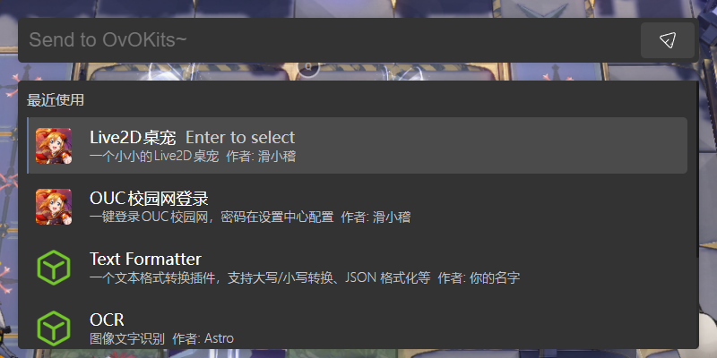
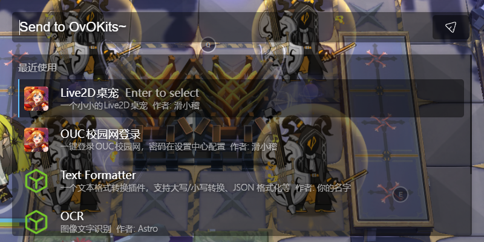
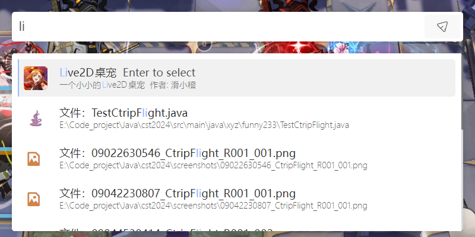
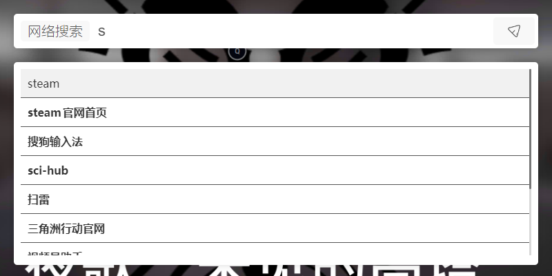

# OvO Kits PC效率工具使用助手

OvO Kits 是一个基于Electron + Vue的免费PC效率工具。结合任意自定义的插件可以快速实现插件开发，帮助用户提高PC使用效率

## 开始运行

运行主程序：

```bash
npm run dev
```

打包主程序：

```bash
npm run build:win
```

## 主程序预览

主界面：






搜索最近使用的文件：


搜索插件：




插件预览界面（以网络搜索为例）：



Live2D桌宠插件：


启动器设置中心：


插件市场：


## 插件开发文档

详见：

。
