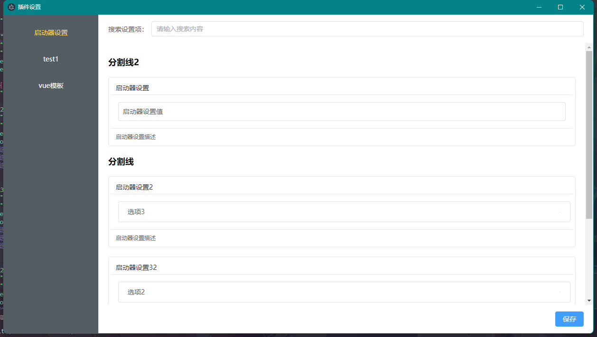

# 插件开发文档

## 插件支持类型：

支持HTML插件（经测试Vue也支持）、exe插件（截止10.22暂未支持）

## 名词说明：

- 启动器：指启动器程序（launcher），提供了插件搜索、插件设置、插件市场（截止10.22暂未支持）、插件启动等功能
- 插件：指插件程序（plugin），提供了一定的功能，如：截图、翻译、计算器等

## 插件加载流程

首先启动器会读取resources/plugins文件夹，并判定文件夹下是否存在config.json，如果存在则认为这个文件夹是一个插件，并按照config.json的配置加载插件。

一个完整的config.json通常包含：

```json
{
    "name": "test1",            // 插件名称，必填
    "version": "1.0.0",         // 插件版本，必填
    "desc": "测试插件1111111",    // 插件描述，必填
    "startType": "html",        // 插件类型，必填。如果是html插件则填写html
    "entry": "index.html",     // 插件入口文件，必填，启动器会读取这个文件并加载
    "author": "滑小稽",         // 插件作者，必填
    "logo": "app.png",          // 插件logo，可选，如果没有则使用默认logo
    "singleton": true,          // 是否单例。为true时一个插件仅允许同时启动一个。可选，默认为false
    "windowOptions": {          // 插件窗口配置，必填，以下仅为常用示例，内容参照Electron窗口配置 https://www.electronjs.org/zh/docs/latest/api/browser-window#new-browserwindowoptions
        "width": 800,
        "height": 600,
        "minWidth": 400,
        "minHeight": 300,
        "maxWidth": 1200,
        "maxHeight": 900,
        "resizable": true,
        "alwaysOnTop": false,
        "frame": true,
        "center": true,
        "title": "Test Plugin 1"
    }
}
```

同样启动器提供了统一的插件配置设置界面，启动器会读取resources/plugins/插件名称/settings.json文件，并提供了一个配置界面可以修改配置。如果插件无需任何配置则可以不提供settings.json文件。

一个示例settings.json

```json


{
    "分割线2": {
        "type": "divider"                    // 分割线   
    },
    "启动器设置": {
        "type": "input",                    // 输入框
        "desc": "启动器设置描述",           // 输入框描述
        "value": "启动器设置值2222",        // 输入框默认值
        "placeholder": "请输入启动器设置"   // 输入框占位符
    },
    "分割线": {
        "type": "divider"
    },
    "启动器设置2": {
        "type": "select",        // 下拉选择框
        "desc": "启动器设置描述",   // 下拉选择框描述
        "value": "选项3",        // 下拉选择框默认值
        "options": [            // 下拉选择框选项
            "选项1",
            "选项2",
            "选项3"
        ]
    },
    "开机自启动": {
        "type": "checkbox",     // 复选框
        "desc": "OvOKits将会在开机时自动启动",  // 复选框描述
        "value": false,         // 复选框默认值
        "label": "开机自启动"       // 复选框的标签
    }
}
```

这样的配置项将会渲染出如下的设置界面：



目前配置项的type支持：divider分割线（也可以当成标题使用）、input输入框、select下拉选择框、checkbox复选框


## 插件开发规范（原生HTML）

在config.json中，需要指定插件类型为html，然后在entry指定的文件中编写插件代码。

例如：当config.json如下配置时：

```json
{
    // ...
    "startType": "html",        // 插件类型，必填。如果是html插件则填写html
    "entry": "index.html",     // 插件入口文件，必填，启动器会读取这个文件并加载
    // ...
}
```
启动器会读取resources/plugins/插件名称/index.html文件并加载。那么只需要在index.html中编写插件代码即可。

## 插件开发规范（Vue3）

对于熟练掌握Vue的开发者，可以使用Vue开发插件。

对于Vue插件插件类型也应该设置为html，然后在entry指定的文件中编写入口代码。例如：

```json
{
    // ...
    "startType": "html",        // 插件类型，必填。如果是html插件则填写html
    "entry": "index.html",     // 插件入口文件，必填，启动器会读取这个文件并加载
    // ...
}
```
但是此处需要index.html的内容必须是以下的内容：
```html
<!DOCTYPE html>
<html lang="en">
<head>
    <meta charset="UTF-8">
    <meta name="viewport" content="width=device-width, initial-scale=1.0">
    <title>Document</title>
    <script src="../_libs/vue3-sfc-loader/vue3-sfc-loader.js"></script>
    <script src="../_libs/vue3/vue.global.js"></script>
</head>

<body>
    <div id="app"></div>
</body>

<script>
    const options = {
        moduleCache: { vue: Vue },
        async getFile(url) {
            const res = await fetch(url);
            if (!res.ok)
                throw Object.assign(new Error(res.statusText + ' ' + url), { res });
            return {
                getContentData: asBinary => asBinary ? res.arrayBuffer() : res.text(),
            }
        },
        addStyle(textContent) {
            const style = Object.assign(document.createElement('style'), { textContent });
            const ref = document.head.getElementsByTagName('style')[0] || null;
            document.head.insertBefore(style, ref);
        },
    }
    const { loadModule } = window['vue3-sfc-loader'];
    const app = Vue.createApp({
        components: {
            'plugin': Vue.defineAsyncComponent(() => loadModule('./index.vue', options))
        },
        template: '<plugin></plugin>'
    });
    app.mount('#app');
</script>
</html>
```
index.html会动态的编译index.vue文件并且加载到页面中。

然后新建一个index.vue文件，在这个文件中编写Vue代码。例如：
```vue
<template>
    <div>{{ count }}</div>
</template>

<script setup>
import { ref } from 'vue'
const count = ref(0)
</script>
```

## HTML API
因为HTML本身不具备调用系统API的能力，所以这里提供了一些API供插件调用。

目前的API还很少，有什么需要的API可以提出，或者直接在/src/preload/index.js中添加，并且在/src/main/index.js中添加对应的事件监听。

~~目前没有考虑到会有人去写api，所以详细的api开发规范先不写了，大家可以参考已有的api进行开发~~

使用API的方法如下：

```javascript
const api = window.api  // 获取api对象，所有的api都挂载在window.api下
const pid = api.getWindowPid(window)    // 获取当前窗口的pid
api.closeWindow(pid)   // 关闭当前窗口
```

目前可用的API有：

#### **getWindowPid(window)**：获取窗口的pid
说明：window为当前窗口对象，可以通过window获取到当前窗口的pid。调用所有的API都需要传入pid，所以在调用API之前需要先获取pid。
```js
const pid = api.getWindowPid(window)
```

#### **closeWindow(pid)**：关闭窗口
说明：关闭指定pid的窗口
```js
api.closeWindow(pid)
```

#### **callWindowMethod(pid, method, ...args)**：调用Electron窗口的原生方法（Beta）
说明：调用指定pid的窗口的原生方法，method为方法名，args为参数。目前这个方法可能带来安全性问题，后期可能考虑修改

原生方法参考 <https://www.electronjs.org/zh/docs/latest/api/browser-window#%E5%AE%9E%E4%BE%8B%E6%96%B9%E6%B3%95>

```js
api.callWindowMethod(pid, 'focus')  // 聚焦于窗口
```

#### **getWindowProperty(pid, property)**：获取Electron窗口的原生属性（Beta）
说明：获取指定pid的窗口的原生属性，property为属性名。目前这个方法可能带来安全性问题，后期可能考虑修改

原生属性参考 <https://www.electronjs.org/zh/docs/latest/api/browser-window#%E5%AE%9E%E4%BE%8B%E5%B1%9E%E6%80%A7>

```js
console.log(api.getWindowProperty(pid, 'isFocused')) // 获取窗口是否聚焦
```

#### **getPluginSettings(pid, settingName)**：获取插件的配置项
说明：获取指定pid的插件的settings.json的配置项，settingName为配置项名。

当setting.json如下时
```json
{
    "用户昵称": {
        "type": "input",
        "desc": "用户名，会改变AI助手的称呼",
        "value": "你好我叫滑小稽",
        "placeholder": "默认用户名"
    }
}
```
那么可以通过以下方法获取用户昵称的值
```js
console.log(api.getPluginSettings(pid, '用户昵称')) // 获取用户昵称的值
// 输出："你好我叫滑小稽"
```


## 常用库
一些常用的库已经被放在了resources/_libs文件夹下，可以直接使用

大家如果有需要的可能常用的库可以直接在这个文件夹下添加，然后在插件中引用即可。


## git提交规范

大家在提交代码时请**务必遵循**以下规范

- **请新建一个分支进行开发，不要直接在master分支上进行开发**，在开发完成后请提交一个pull request，基本完成后会合并到master分支